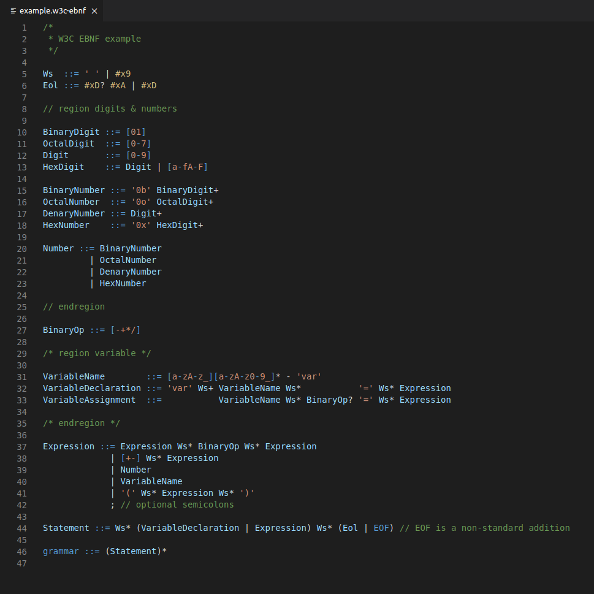

<!--
  Copyright (c) 2021 Michael Federczuk
  SPDX-License-Identifier: CC-BY-SA-4.0
-->

# W3C's EBNF Notation for VSCode #

[version_shield]: https://img.shields.io/badge/version-0.2.0-informational.svg
[release_page]: https://github.com/mfederczuk/w3c-ebnf-vscode/releases/tag/v0.1.0 "Release v0.2.0"
[![version: 0.2.0][version_shield]][release_page]

## About ##

Adds syntax highlighting support for [W3C's EBNF notation] defined in the XML specification.

[W3C's EBNF notation]: https://www.w3.org/TR/2008/REC-xml-20081126/#sec-notation "Extensible Markup Language (XML) 1.0 (Fifth Edition) - 6 Notation"

## Contributing ##

Read through the [Contribution Guidelines](CONTRIBUTING.md) if you want to contribute to this project.

## License ##

The extension is licensed under both the [**Mozilla Public License 2.0**](LICENSES/MPL-2.0.txt) AND the
[**Apache License 2.0**](LICENSES/Apache-2.0.txt).  
For more information about copying and licensing, see the [`COPYING.txt`](COPYING.txt) file.
